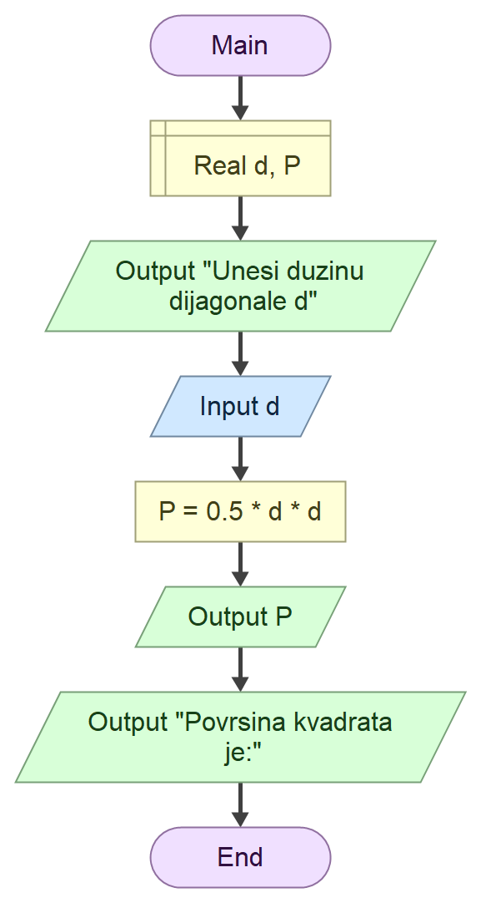

# Domaci zadatak iz Tehnicke dokumentacije

## Zadatak 

Program koji na osnovu unete duzine **dijagonale** kvadrata d izracunava **Povrsinu** kvadrata P

## formula
$$
\frac{1}{2} d^2
$$

### Algoritamska sema

## Resenje

''' cs

using System;

class Program
{
    static void Main()
    {
        Console.WriteLine("Program za izračunavanje površine kvadrata.");
        Console.WriteLine("Formula: P = 1/2 * d^2");
        
       
        Console.Write("Unesite dijagonalu kvadrata d: ");
        double d;
        
        
        if (double.TryParse(Console.ReadLine(), out d) && d > 0)
        {
           
            double P = 0.5 * d * d;
            Console.WriteLine($"Površina kvadrata sa dijagonalom {d} je: {P}");
        }
        else
        {
            Console.WriteLine("Unos nije validan! Dijagonala mora biti pozitivan broj.");
        }

        Console.WriteLine("Pritisnite bilo koji taster za izlaz.");
        Console.ReadKey();
    }
}
'''

### Test primeri

prvi test primeri:

''' text
Program za izracunavanje povrsine kvadrata.
Formula: P = 1/2 * d^2
Unesite dijagonalu kvadrata d: 4.28
Povrsina kvadrata sa dijagonalom 4.28 je: 9.1592
Pritisnite bilo koji taster za izlaz.

C:\Users\ognje\source\repos\ConsoleApp1\ConsoleApp1\bin\Debug\ConsoleApp1.exe (process 4392) exited with code 0 (0x0).
To automatically close the console when debugging stops, enable Tools->Options->Debugging->Automatically close the console when debugging stops.
Press any key to close this window . . .
'''

Drugi test primeri:

''' text
Program za izracunavanje povrsine kvadrata.
Formula: P = 1/2 * d^2
Unesite dijagonalu kvadrata d: 12
Povrsina kvadrata sa dijagonalom 12 je: 72
Pritisnite bilo koji taster za izlaz.

C:\Users\ognje\source\repos\ConsoleApp1\ConsoleApp1\bin\Debug\ConsoleApp1.exe (process 736) exited with code 0 (0x0).
To automatically close the console when debugging stops, enable Tools->Options->Debugging->Automatically close the console when debugging stops.
Press any key to close this window . . .
'''

### Objekti

| Redni broj | Naziv promenljive | Tip promeljive |
|------------| ----------------- | -------------  |
| 1.         | 'd'               | 'double'       |
| 2.         | 'P'               | 'double'       |
